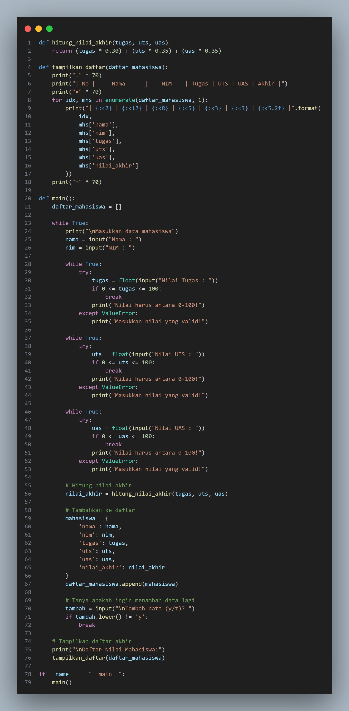
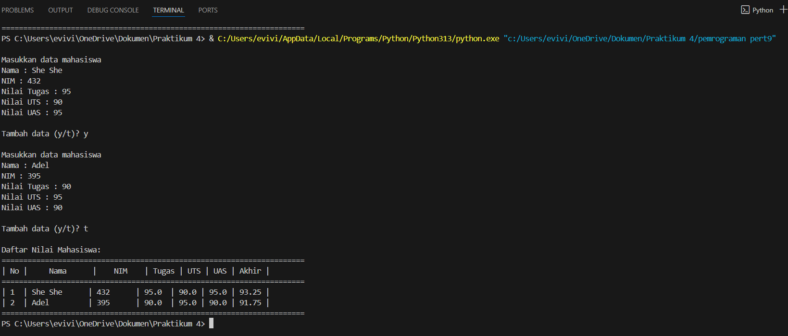
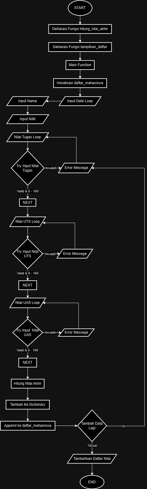

# TUGAS PRAKTIKUM 5
# Data Diri

Nama : She She Metahanover

NIM : 312410432

Kelas : TI.24.A.3

# input dan output dari Praktikum 5
## input



## output



## flowchart




# 1. Fungsi `hitung_nilai_akhir(tugas, uts, uas)`:
```python
def hitung_nilai_akhir(tugas, uts, uas):
    return (tugas * 0.30) + (uts * 0.35) + (uas * 0.35)
```
- Fungsi ini menerima 3 parameter: nilai tugas, UTS, dan UAS
- Menghitung nilai akhir dengan bobot: 
  - Tugas: 30% (0.30)
  - UTS: 35% (0.35)
  - UAS: 35% (0.35)
- Mengembalikan hasil perhitungan nilai akhir

# 2. Fungsi `tampilkan_daftar(daftar_mahasiswa)`:
```python
def tampilkan_daftar(daftar_mahasiswa):
    print("=" * 70)  # Membuat garis pembatas
    print("| No |     Nama      |    NIM    | Tugas | UTS | UAS | Akhir |")
    print("=" * 70)  # Membuat garis pembatas
```
- Menerima parameter berupa list yang berisi data mahasiswa
- Membuat tampilan tabel dengan header
- Menggunakan perulangan untuk menampilkan setiap data mahasiswa
- Format output menggunakan string formatting untuk merapikan tampilan
- `enumerate(daftar_mahasiswa, 1)` digunakan untuk membuat penomoran mulai dari 1

# 3. Fungsi `main()`:
```python
def main():
    daftar_mahasiswa = []  # Inisialisasi list kosong
```
- Fungsi utama program
- Membuat list kosong untuk menyimpan data mahasiswa

# 4. Input Data dan Validasi:
```python
while True:
    print("\nMasukkan data mahasiswa")
    nama = input("Nama : ")
    nim = input("NIM : ")
    
    while True:
        try:
            tugas = float(input("Nilai Tugas : "))
            if 0 <= tugas <= 100:
                break
            print("Nilai harus antara 0-100!")
        except ValueError:
            print("Masukkan nilai yang valid!")
```
- Menggunakan nested while loop untuk input dan validasi
- Try-except untuk menangani input nilai yang tidak valid
- Validasi rentang nilai (0-100)
- Proses yang sama dilakukan untuk nilai UTS dan UAS

# 5. Menyimpan Data:
```python
# Hitung nilai akhir
nilai_akhir = hitung_nilai_akhir(tugas, uts, uas)

# Tambahkan ke daftar
mahasiswa = {
    'nama': nama,
    'nim': nim,
    'tugas': tugas,
    'uts': uts,
    'uas': uas,
    'nilai_akhir': nilai_akhir
}
daftar_mahasiswa.append(mahasiswa)
```
- Memanggil fungsi hitung_nilai_akhir
- Membuat dictionary untuk menyimpan data satu mahasiswa
- Menambahkan dictionary ke dalam list daftar_mahasiswa

# 6. Konfirmasi Tambah Data:
```python
tambah = input("\nTambah data (y/t)? ")
if tambah.lower() != 'y':
    break
```
- Meminta konfirmasi untuk menambah data lagi
- Jika input bukan 'y', keluar dari loop

# 7. Menampilkan Hasil:
```python
print("\nDaftar Nilai Mahasiswa:")
tampilkan_daftar(daftar_mahasiswa)
```
- Memanggil fungsi tampilkan_daftar untuk menampilkan semua data

# 8. Entry Point Program:
```python
if __name__ == "__main__":
    main()
```
- Memastikan fungsi main() hanya dijalankan jika file dijalankan langsung
- Tidak akan dijalankan jika file di-import sebagai modul

Fitur-fitur Program:
1. Dapat menambahkan data mahasiswa secara dinamis
2. Validasi input untuk nilai (harus numerik dan 0-100)
3. Perhitungan nilai akhir otomatis dengan bobot yang ditentukan
4. Tampilan output dalam bentuk tabel yang rapi
5. Penanganan error untuk input yang tidak valid
6. Konfirmasi untuk menambah data baru

Program ini dibuat untuk memudahkan pengelolaan data nilai mahasiswa dengan interface yang user-friendly dan penanganan error yang baik.